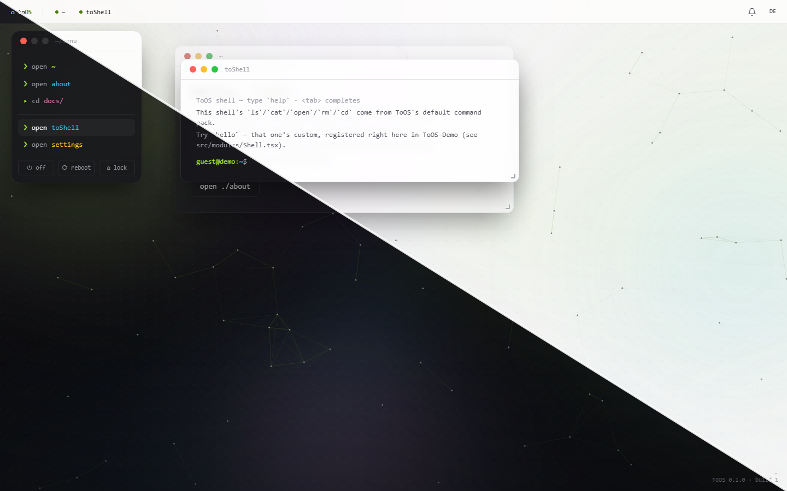

# ToOS-Demo

[](https://github.com/ToBee94/ToOS-Demo/actions/workflows/ci.yml)
[](https://github.com/ToBee94/ToOS-Demo/actions/workflows/deploy.yml)

A small, standalone app that proves **[ToOS](https://github.com/ToBee94/ToOS)**
works outside the site it was extracted from — installed as a plain npm
dependency, no shared code, no monorepo.

**[Live demo →](https://tobee94.github.io/ToOS-Demo/)**



```
guest@demo:~$ ls
docs/   start   about   terminal   settings   links/
guest@demo:~$ cd docs && open guide
opening: docs/guide …
```

## What it demonstrates

| Feature | Where |
|---|---|
| Basic module registration | `src/modules/Start.tsx`, `About.tsx` |
| Folders / submenus (`docs/`) | `src/menu.ts` |
| A tabbed window (side nav for free) | `src/modules/docs/*` → `guide` in `src/App.tsx` |
| The ready-made Settings window | `SETTINGS_TABS` in `src/App.tsx` |
| The terminal, default command pack | `src/modules/Shell.tsx` |
| A custom terminal command (`hello`) | `src/modules/Shell.tsx` |
| The `~/links` virtual folder | `src/modules/Shell.tsx` |
| `motd` | `SiteConfig.motd` in `src/App.tsx` |
| Deep linking (`onTopChange` → router) | `src/App.tsx`, `src/main.tsx` |

Every one of these is covered in more depth in
[ToOS's documentation](https://github.com/ToBee94/ToOS/tree/master/docs) —
this app is the "does it actually work" companion to those docs, not a
replacement for them.

## Run it locally

```bash
npm install
npm run dev
```

`@tobee94/toos` is a normal npm dependency (see `package.json`) — nothing
special to set up, no sibling repo required.

```bash
npm run typecheck
npm run lint
npm run build      # also copies dist/index.html → dist/404.html (SPA fallback for GitHub Pages)
```

## How it's deployed

Pushing to `main`/`master` builds the app and publishes it to GitHub Pages
via `.github/workflows/deploy.yml` (`actions/upload-pages-artifact` +
`actions/deploy-pages` — the repo's Pages source needs to be set to "GitHub
Actions" once in the repo settings). Since Pages serves this as a project
page under `/ToOS-Demo/`, `vite.config.ts` sets `base` accordingly and
`main.tsx` passes the same value as the router's `basename`.
